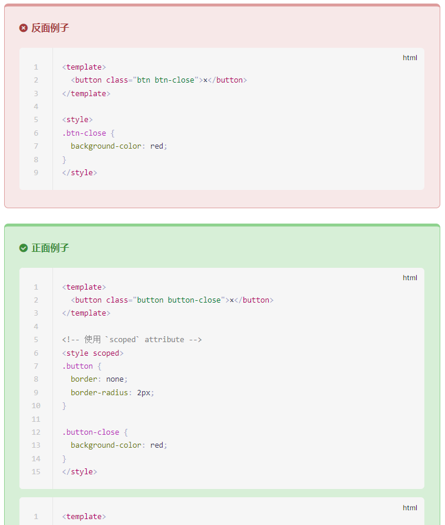

> This is [VuePress@2](https://v2.vuepress.vuejs.org/zh/) plugin for show style-guide code. like https://v3.cn.vuejs.org/style-guide/



## Usage

vuepress `config.ts`

```
{
	  plugins: [
			[
				'vuepress-plugin-code-style-recommend',
				{
					goodText: '', //good style title, default is '正面例子'
					badText: '',//bad style title, default is '反面例子'
				},
			],
	  ]
}
```
